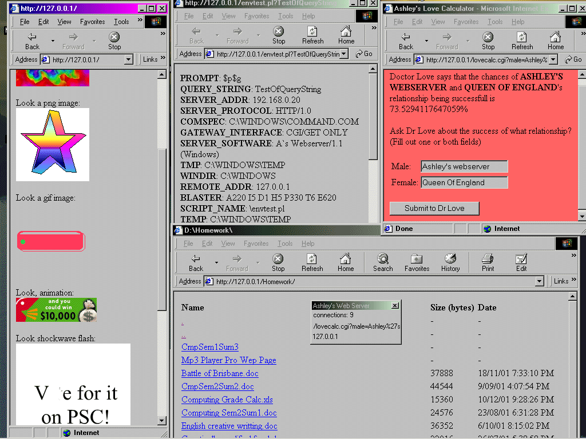



## Ashleys Webserver

### Description

(OBSOLETE! see 'a complete perl, php and asp webserver' on this site) The FIRST webserver on PSC that supports form posting! (see

screenshot). It currently supports perl cgi. Also supported are directory

listings, custom front pages, custom error pages. It also supports flash,

pdf, realmedia, mp3s, avi's, etc. Included is a useless but amusing

'loveclaculator.cgi' I built (basically to prove form submission works). You

could host a full website here! I'm using it to 'preview' cgi-enabled

websites before uploading them to the http server, although, you could host

a full website on it. Perl must be installed on your system, and in your

msdos PATH variable (see contained instructions).

Currently, the server only supports GET without modification of your CGI

scripts, although, a full range of $ENV variables are available to your CGI

scripts (query_string, remote_addr, server_port, server_addr, etc.) (see

screenshot). and GET is suitable for almost every operation. Just file

uploading from a form is impossible, but, I'm working on it.

This release is a major jump from the last one, with directory listing, more

$ENV variables, custom 404 pages, and full support for sub directories (with

/../ protection).

Please download and tell me what you think, or, better, use it.
 
### More Info
 

             |
---                |---
**Submitted On**   |2002-01-22 18:09:08
**By**             |[Ashley Harris](https://github.com/Planet-Source-Code/PSCIndex/blob/master/ByAuthor/ashley-harris.md)
**Level**          |Intermediate
**User Rating**    |5.0 (677 globes from 136 users)
**Compatibility**  |VB 6\.0
**Category**       |[Internet/ HTML](https://github.com/Planet-Source-Code/PSCIndex/blob/master/ByCategory/internet-html__1-34.md)
**World**          |[Visual Basic](https://github.com/Planet-Source-Code/PSCIndex/blob/master/ByWorld/visual-basic.md)
**Archive File**   |[Ashleys\_We504701222002\.zip](https://github.com/Planet-Source-Code/ashley-harris-ashleys-webserver__1-30748/archive/master.zip)

